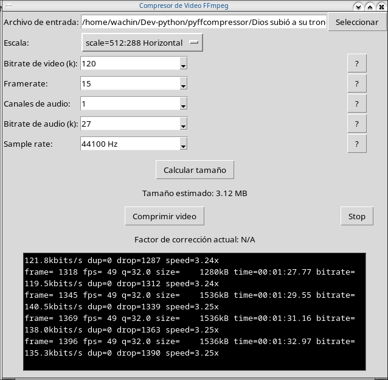
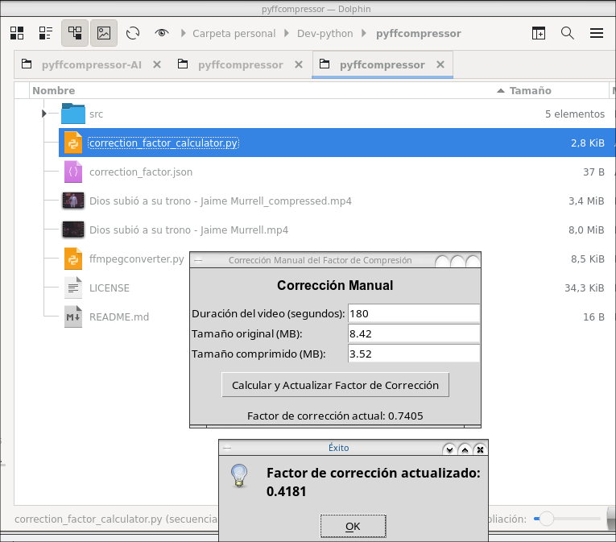

# pyffcompressor

# Tutorial de usuario para instalar las dependencias y usar los scripts para lanzar las interfaces gráficas en Python en Debian 12:

El propósito de este programa es comprimir videos para poder enviarlos por WhatsApp y que tengan la mejor calidad de video y audio posible sin perder tanta calidad (se perderá algo) el que solo permite enviar archivos de video de 16 MB. El video más largo que he comprimido es uno que tenía 23:12min y lo comprimió a 14.2MB con una escala de 512:288 Bitrade de víde 63k Framerate: 15, Canales de audio: 1, Bitrate de audio 18k y un Sample rate de: 44100 Hz. Pero si su video no es tan grande use las opciones que le he dejado al programa por defecto, y calcule el tamño y si se pasa de 16 MB baje el Bitrate de video y el Bitrate del audio

A continuación les dejo un archivo con muchas conversiones exitosas que he hecho, en la siguiente ruta:

src/Compresiones_hechas_con_exito.md

es un archivo Markdown, lo pueden abrir con un editor de texto o con Ghostwriter, Typora, Formiko, Apostrophe, retext, etc

**Tutorial de Usuario:** Compresor de Video FFmpeg y Calculadora de Factor de Corrección

1. Instalación de Dependencias

Abre una terminal y ejecuta el siguiente comando para instalar todas las dependencias necesarias:

```
sudo apt-get install python3-tk ffmpeg python3-psutil tk-dev
```

Este comando instala:
- python3-tk: Biblioteca para crear interfaces gráficas en Python
- ffmpeg: Herramienta para procesar archivos multimedia
- python3-psutil: Biblioteca para obtener información sobre procesos del sistema
- tk-dev: Archivos de desarrollo para Tk, necesarios para algunas funcionalidades avanzadas

2. Descripción de los Scripts

a) **ffmpegcompressor.py**



Este script es el compresor principal de video. Proporciona una interfaz gráfica que permite:

- Seleccionar un archivo de video para comprimir
- Ajustar parámetros de compresión como escala, bitrate de video, framerate, canales de audio, bitrate de audio y sample rate
- Comprimir el video seleccionado con los parámetros especificados
- Ver en tiempo real la salida de ffmpeg durante la compresión
- Detener el proceso de compresión si es necesario

b) **correction_factor_calculator.py**



Este script es una herramienta auxiliar para calcular y ajustar el factor de corrección usado en las estimaciones de tamaño de archivo. Permite:

- Ingresar manualmente la duración, tamaño original y tamaño comprimido de un video
- Calcular un nuevo factor de corrección basado en estos datos
- Actualizar el factor de corrección almacenado en correction_factor.json

3. Cómo Usar los Scripts

a) Para usar ffmpegcompressor.py:
1. Abre una terminal en el directorio donde se encuentra el script
2. Ejecuta el script con el comando:
   ```
   python3 ffmpegcompressor.py
   ```
3. En la interfaz gráfica, selecciona un archivo de video y ajusta los parámetros de compresión
4. Haz clic en "Comprimir video" para iniciar el proceso
5. Observa el progreso en la caja de texto negra
6. Si necesitas detener la compresión, haz clic en "Stop"

b) Para usar correction_factor_calculator.py:
1. Abre una terminal en el directorio donde se encuentra el script
2. Ejecuta el script con el comando:
   ```
   python3 correction_factor_calculator.py
   ```
3. En la ventana que aparece, ingresa:
   - La duración del video en segundos
   - El tamaño original del video en MB
   - El tamaño comprimido del video en MB
4. Haz clic en "Calcular y Actualizar Factor de Corrección"
5. El nuevo factor de corrección se guardará automáticamente y se mostrará en la interfaz

**Nota:** El factor de corrección calculado se guarda en un archivo llamado correction_factor.json en el mismo directorio. Este archivo es utilizado por ffmpegcompressor.py para mejorar las estimaciones de tamaño de archivo.

Recuerda que para obtener los mejores resultados, es recomendable usar correction_factor_calculator.py periódicamente con diferentes videos para mantener el factor de corrección actualizado y preciso.

Dios te bendiga